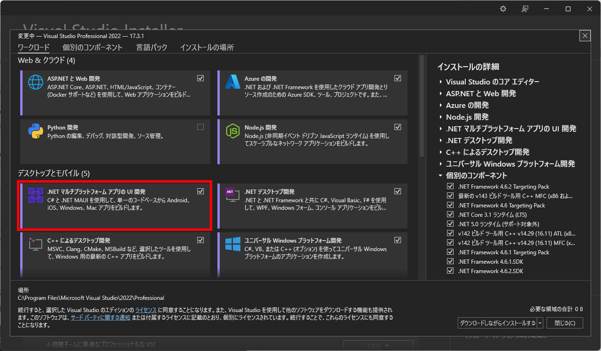
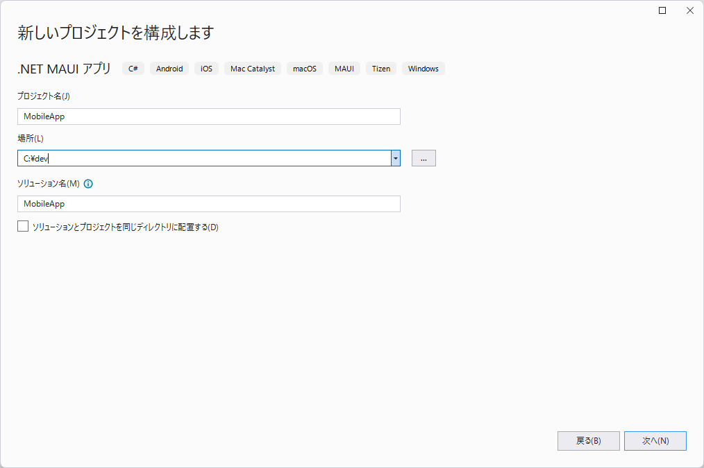
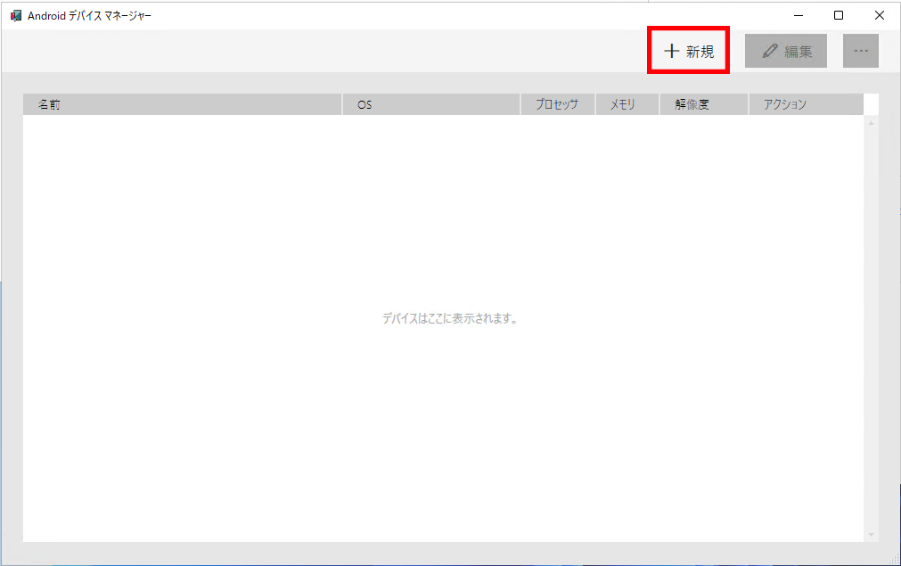

# ハンズオンドキュメント

## 目次

- 目次を最後に書く

## このドキュメントの場所

`https://github.com/yoHoshino/TrMauiChatApp`

## .NET MAUI hands on lab

このドキュメントでは .NET MAUI と Microsoft.Toolkit.Mvvm を利用した MVVM によるモバイルアプリ開発をハンズオンで学習します。
開発するのは [Azure OpenAI Service](https://learn.microsoft.com/ja-jp/azure/ai-services/openai/overview)(以下AOAI) に接続し、Chat Bot と会話するモバイルアプリです。

## システム要件

- 最新の Windows または macOS
- 最新の Visual Studio 2022 または Visual Studio Code
  - Microsoft.Toolkit.Mvvm パッケージ
- Android SDK
  - Android Emulator

## Visual Studio 2022 のインストール

Visual Studio 2022 の[ダウンロードページ](https://visualstudio.microsoft.com/ja/downloads/)からダウンロードします。  
ダウンロードした `VisualStudioSetup.exe` を実行すると、Visual Studio Installer が起動します。

## ワークロードのインストール

Visual Studio Installer を起動して「.NET マルチプラットフォーム アプリの UI 開発」をインストールします。


## .NET MAUI アプリの作成と動作確認

Visual Studio を起動して「新しいプロジェクト」をクリックします。  


ダイアログで検索窓に `maui` と入力し、「.NET MAUI アプリ」をクリックして .NET MAUI プロジェクトを作成します。  


任意の名前とフォルダにプロジェクトを構成します。（本ドキュメントでは `MobileApp` という名前空間ですので合わせても良いでしょう。）  


フレームワークは「.NET 8.0（長期的なサポート）」を選択してプロジェクトを作成します。
  

## 最初の起動

Android エミュレーターをドロップダウンから選択してデバッグ実行ができます。  
「Android Emulators」が表示されていない場合は、新規にエミュレーターを作成する必要があります。  


### Android エミュレーターの作成

ドロップダウンから「Android デバイスマネージャー」をクリックします。  
表示されるダイアログで「新規」ボタンをクリックします。表示されない場合は、「ツール＞Android＞Android デバイスマネージャー」をクリックします。  
「新規」ボタンをクリックします。  


- 基本デバイス：デバイスのテンプレートでデバイスに応じた画面サイズやメモリ量が決まります。`Pixel 5` などを選んでおくと良いでしょう。
- プロセッサ：`x86` か `x86_64` を選択します。（Intel CPU の仮想化に Hyper-V または Intel HAXM が必要です。）
- OS：エミュレーターの OS を指定します。
- Google APIs／Google Play Store：Google Play Store にチェックを付けると Emulator でマップやストアが利用できます。


各種選択した状態で「新しいデバイスイメージがダウンロードされます。」という注意書きがある場合は、Android SDK のダウンロードサイトから条件に見合った OS イメージを自動でダウンロードしてエミュレーターを作成します。

### デバッグ実行

準備が整ったところで最初のデバッグ実行をしてみましょう。  
Android エミュレーターが起動して、次のような画面が表示されれば OK です。

### デフォルトプロジェクトの構成

```text
+ MobileApp
  - Platforms フォルダ
    - Android, iOS, MacCatalyst, Tizen, Windows フォルダ
  - Resources フォルダ
  - App.xaml / App.xaml.cs
  - AppShell.xaml.cs / AppShell.xaml
  - MauiProgram.cs
  - MainPage.xaml / MainPage.xaml.cs
```

#### `Platforms` フォルダ

各ターゲット プラットフォームのフォルダーには、各プラットフォームでアプリを起動するプラットフォーム固有のコードと、追加するプラットフォーム コードが含まれています。  
各種フォルダーは、.NET MAUI がターゲットにできるプラットフォームを表します。

#### `MauiProgram.cs`

アプリケーションのエントリーポイントです。  
プラットフォーム（Android, iOS, Mac, Win）ごとにアプリエントリポイント（`MainApplication` クラス）があり、そこから `CreateMauiApp` メソッドが呼び出されます。

```cs
public static class MauiProgram
{
    public static MauiApp CreateMauiApp()
    {
        var builder = MauiApp.CreateBuilder();
        builder
            .UseMauiApp<App>()
            .ConfigureFonts(fonts =>
            {
                fonts.AddFont("OpenSans-Regular.ttf", "OpenSansRegular");
                fonts.AddFont("OpenSans-Semibold.ttf", "OpenSansSemibold");
            });

#if DEBUG
        builder.Logging.AddDebug();
#endif

        return builder.Build();
    }
}
```

#### `App.xaml.cs`

`App` クラスは `Application` クラスから派生しています。

`App` メソッド内で、初期ページのプロパティ `MainPage` に `AppShell` クラスのインスタンスを指定しています。

```cs
public partial class App : Application
{
    public App()
    {
        InitializeComponent();

        MainPage = new AppShell();
    }
}
```

.NET MAUI Shell アプリでは、アプリのビジュアル階層は、クラスをサブクラス化する Shell クラスで記述されます。

このクラスは、次の 3 つの主要な階層オブジェクトのいずれかで構成されます。([詳細はこちら](https://learn.microsoft.com/ja-jp/dotnet/maui/fundamentals/shell/?view=net-maui-8.0#app-visual-hierarchy))

1. FlyoutItem または TabBar
1. Tab
1. ShellContent

#### `AppShell.xaml`

MobileApp では `ShellContent` で構成されていることが確認できます。

```xml
<?xml version="1.0" encoding="UTF-8" ?>
<Shell
    x:Class="MobileApp.AppShell"
    xmlns="http://schemas.microsoft.com/dotnet/2021/maui"
    xmlns:x="http://schemas.microsoft.com/winfx/2009/xaml"
    xmlns:local="clr-namespace:MobileApp"
    Shell.FlyoutBehavior="Disabled">

    <ShellContent
        Title="Home"
        ContentTemplate="{DataTemplate local:MainPage}"
        Route="MainPage" />

</Shell>
```

#### `AppShell.xaml.cs`

AppShell のパーシャルクラスで、コードビハインドと呼ばれます。

#### `MainPage.xaml`

View のクラスです。XML ベースのクラスを表す言語 XAML で記述します。要素（Element）がインスタンスを表し、属性（Attribute）がプロパティなどを表します。

```xml
<?xml version="1.0" encoding="utf-8" ?>
<ContentPage xmlns="http://schemas.microsoft.com/dotnet/2021/maui"
             xmlns:x="http://schemas.microsoft.com/winfx/2009/xaml"
             x:Class="MobileApp.MainPage">

    <ScrollView>
        <VerticalStackLayout
            Padding="30,0"
            Spacing="25">
            <Image
                Source="dotnet_bot.png"
                HeightRequest="185"
                Aspect="AspectFit"
                SemanticProperties.Description="dot net bot in a race car number eight" />

            <Label
                Text="Hello, World!"
                Style="{StaticResource Headline}"
                SemanticProperties.HeadingLevel="Level1" />

            <Label
                Text="Welcome to &#10;.NET Multi-platform App UI"
                Style="{StaticResource SubHeadline}"
                SemanticProperties.HeadingLevel="Level2"
                SemanticProperties.Description="Welcome to dot net Multi platform App U I" />

            <Button
                x:Name="CounterBtn"
                Text="Click me"
                SemanticProperties.Hint="Counts the number of times you click"
                Clicked="OnCounterClicked"
                HorizontalOptions="Fill" />
        </VerticalStackLayout>
    </ScrollView>

</ContentPage>
```

#### `MainPage.xaml.cs`

MainPage のパーシャルクラスで、コードビハインドと呼ばれます。

`OnCounterClicked` は `CounterBtn` の `Clicked` にバインディングされています。

ボタンをクリックすると数字が１つずつ増えていきます。

```cs
public partial class MainPage : ContentPage
{
    int count = 0;

    public MainPage()
    {
        InitializeComponent();
    }

    private void OnCounterClicked(object sender, EventArgs e)
    {
        count++;

        if (count == 1)
            CounterBtn.Text = $"Clicked {count} time";
        else
            CounterBtn.Text = $"Clicked {count} times";

        SemanticScreenReader.Announce(CounterBtn.Text);
    }
}
```

起動確認は以上です。

## AOAIへの接続

### モデルクラスの作成

まずは Model クラスを作成します。

プロジェクトを右クリックして「追加＞クラス」から `Message` クラスを作成します。次のようになります。  

```csharp
namespace TrMauiChatApp;
public class Message
{
    public string MessageText { get; set; }
    public string TimeStamp { get; set; }
    public bool IsUserMessage { get; set; }
}
```

### View の作成

次に View を作成していきましょう。`MainPage.xaml` を開きます。

`ScrollView` 内をすべて削除し、次の XAML で置き換えます。次のようになります。

```xml
    <Grid Padding="10" RowDefinitions="*, Auto">
        <RefreshView x:Name="ChatRefreshView" Refreshing="PullToRefreshing">
            <CollectionView Grid.Row="0" ItemsSource="{Binding}"
                            SelectionMode="None">
                <CollectionView.ItemTemplate>
                    <DataTemplate>
                        <StackLayout Orientation="Horizontal"
                                     HorizontalOptions="{Binding IsUserMessage, Converter={StaticResource BoolToHorizontalOptionsConverter}}">
                            <Image Source="dotnet_bot.png"
                                   WidthRequest="40"
                                   HeightRequest="40"
                                   Margin="5"
                                   IsVisible="{Binding IsUserMessage, Converter={StaticResource BoolToVisibilityConverter}}" />
                            <Frame BackgroundColor="{Binding IsUserMessage, Converter={StaticResource BoolToColorConverter}}"
                                   CornerRadius="10"
                                   Padding="10"
                                   Margin="5"
                                   HasShadow="True"
                                   HorizontalOptions="StartAndExpand">
                                <Label Text="{Binding MessageText}"
                                       FontSize="16"
                                       TextColor="Black"/>
                            </Frame>
                        </StackLayout>
                    </DataTemplate>
                </CollectionView.ItemTemplate>
            </CollectionView>
        </RefreshView>
        <Grid Grid.Row="1" ColumnDefinitions="*, Auto" Padding="10" x:Name="input">
            <Editor x:Name="MessageEntry"
                    Placeholder="Enter a message"
                    Grid.Column="0"
                    AutoSize="TextChanges"/>
            <Button x:Name="SendButton"
                    Text="Send"
                    Clicked="OnSendClicked"
                    Grid.Column="1"/>
        </Grid>
    </Grid>
```

後ほど、同じような View を順を追って少しずつ作成しますので、ここでの詳しい説明は割愛します。

### コードビハインドにコードを追加

`MainPage.xaml.cs` を開きます。

クラス変数として以下を追加します。

```csharp
    public ObservableCollection<Message> ChatMessages { get; set; } = new();
```

次にコンストラクターの下にいくつかのメソッドを追加します。

```csharp
    protected override void OnAppearing()
    {
        base.OnAppearing();
        InitializeChat();
    }

    void InitializeChat()
    {
        ChatMessages.Clear();
        ChatMessages.Add(new Message { MessageText = "質問を入力してください", IsUserMessage = false });
        BindingContext = ChatMessages;
    }

    async void OnSendClicked(object sender, EventArgs e)
    {
        MessageEntry.IsEnabled = false;
        SendButton.IsEnabled = false;

        var userMessage = new Message { MessageText = MessageEntry.Text, IsUserMessage = true };
        ChatMessages.Add(userMessage);
        MessageEntry.Text = string.Empty;

        var responseMessage = await SendRequestAsync(userMessage.MessageText);
        ChatMessages.Add(responseMessage);

        MessageEntry.IsEnabled = true;
        SendButton.IsEnabled = true;
    }

    async void PullToRefreshing(object sender, EventArgs e)
    {
        MessageEntry.IsEnabled = false;
        SendButton.IsEnabled = false;

        await Task.Delay(1000);
        InitializeChat();
        ChatRefreshView.IsRefreshing = false;

        MessageEntry.IsEnabled = true;
        SendButton.IsEnabled = true;
    }

    async Task<Message> SendRequestAsync(string userMessage)
    {
        return new Message
        {
            MessageText = userMessage,
            IsUserMessage = false
        };
    }
```

いくつかのポイントを説明します。

- `OnAppearing` はページ表示時のイベントです。
- `InitializeChat` は表示データの初期化を実施し、`BindingContext` に `ChatMessages` を指定しています。
- `OnSendClicked` は `Button` のイベントハンドラーです。
- `PullToRefreshing` は `RefreshView` の `Refreshing` のイベントハンドラーです。
- `SendRequestAsync` は ダミーデータ(ユーザー入力した文言のオウム返し)を作成し返却します。

### 動作確認(ダミーデータ)

ここでデバッグ実行してみましょう。次のような画面が表示されれば OK です。  
Chatを入力すると、入力した文言をオウム返しされるので試してみましょう。  
<!-- markdownlint-disable MD033 -->


### AOAI Endpoint への接続切り替え

`SendRequestAsync` メソッドを、実際のAOAIのEndpointにChatを投げるよう以下のコードに置き換えます。(`_url`と`_apiKey`の内容は別途お伝えします)  
※ 実際の開発では、このようにコードに直接Key情報を書き込むべきではありません。今回はあくまでハンズオンのコードなのでこのようにしています。

```cs
    static readonly HttpClient _httpClient = new HttpClient();
    static readonly string _url = "";
    static readonly string _apiKey = "";
    async Task<Message> SendRequestAsync(string userMessage)
    {
        var requestBody = new
        {
            messages = new[]
            {
                    new { role = "system", content = "あなたは.NETのマスコットキャラクターである.NET Bot君です。.NET MAUIに関することを教えてください。" },
                    new { role = "user", content = userMessage },
                    new { role = "assistant", content = "" }
                },
            temperature = 0.8,
            top_p = 0.95,
            frequency_penalty = 0,
            presence_penalty = 0,
            max_tokens = 800,
            stop = "null"
        };

        var json = JsonSerializer.Serialize(requestBody);
        var content = new StringContent(json, Encoding.UTF8, "application/json");
        _httpClient.DefaultRequestHeaders.Clear();
        _httpClient.DefaultRequestHeaders.Add("api-key", _apiKey);

        var response = await _httpClient.PostAsync(_url, content);

        if (response.IsSuccessStatusCode)
        {
            var responseBody = await response.Content.ReadAsStringAsync();
            var responseJson = JsonDocument.Parse(responseBody);
            var assistantMessageContent = responseJson.RootElement
                .GetProperty("choices")[0]
                .GetProperty("message")
                .GetProperty("content")
                .GetString();

            var assistantMessage = new Message
            {
                MessageText = assistantMessageContent ?? "Error!!",
                IsUserMessage = false
            };
            return assistantMessage;
        }
        else
        {
            return new Message
            {
                MessageText = $"Error: {response.StatusCode}",
                IsUserMessage = false
            };
        }
    }
```

再度デバッグ実行し、Chatで質問をしてみます。以下のように適切な回答が得られればOKです。  


標準の .NET MAUI の内容は以上です。

## CommunityToolkit.Mvvmを使用したMVVMとデータバインディングの解説

### MVVMとは

アプリのプログラムを、Model - View - ViewModelという3つの役割に分けて実装するアーキテクチャです。[Model-View-ViewModel (MVVM) | .NET アプリケーション アーキテクチャ ガイド](https://learn.microsoft.com/ja-jp/dotnet/architecture/maui/mvvm)に詳しく解説されています。

### データバインディング

Model - View - ViewModelにプログラムを分けた場合、それぞれのプログラム間でデータのやりとりをする必要があります。例えばModelクラスにおいてHTTPでデータを取得した場合、それをView側に反映させるには変更通知と呼ばれる仕組みを実装する必要があります。  
CommunityToolkit.Mvvmを使用したViewとViewModelのデータバインディングを、MainPage.xamlとViewModelBase.csを例に見ていきましょう。

```xml
<?xml version="1.0" encoding="utf-8" ?>
<ContentPage xmlns="http://schemas.microsoft.com/dotnet/2021/maui"
             xmlns:x="http://schemas.microsoft.com/winfx/2009/xaml"
             x:Class="MobileApp.Views.MainPage"
             xmlns:viewModel="clr-namespace:MobileApp.ViewModels"
             xmlns:model="clr-namespace:MobileApp.Models"
             x:DataType="viewModel:MainPageViewModel"
             Title="{Binding Title}">
```

```cs
using CommunityToolkit.Mvvm.ComponentModel;

namespace MobileApp.ViewModels;

[ObservableObject]
public partial class ViewModelBase
{
    [ObservableProperty]
    private string _title;
}
```

一見どこがどうバインディングされているかわからないかと思いますが、xaml側の`Title="{Binding Title}"`とViewModel側の`private string _title;`はバインディングされています。  
`[ObservableProperty]`というAttributeはCommunityToolkit.Mvvmをインストールすることで使用できるもので、裏側で面倒なバインディングのための記述を生成してくれます。  
本来CommunityToolkit.Mvvmを導入しない場合は下記のようにViewModelを記述しないといけません。プロパティやViewModelのクラスを追加するたびに都度このような記述をしなければなりませんが、CommunityToolkit.Mvvmの機能によりAttributeを付けるだけ裏側でコード生成してくれるので、プログラマーの負担が減ります。

```cs
using System.ComponentModel;
using System.Runtime.CompilerServices;

namespace MobileApp2.ViewModels;

public class ViewModelBase : INotifyPropertyChanged
{
    string _title;

    public string Title
    {
        get => _title;
        set
        {
            if (_title == value)
                return;

            _title = value;
            OnPropertyChanged();
        }
    }


    public event PropertyChangedEventHandler PropertyChanged;

    public void OnPropertyChanged([CallerMemberName]string name = null)
    {
        PropertyChanged?.Invoke(this, new PropertyChangedEventArgs(name));
    }
}

```

### コマンドバインディング

先ほどの章では、Viewのコードビハインドにイベントハンドラーを実装しました。  
しかし、MVVMパターンではViewModelのメソッドをViewからコールする必要があります。そこで、C#ではICommandというinterfaceが用意されています。ただのイベントハンドラーに比べ、抽象化されUIのイベントの実行をしやすいものになっています。

```cs
public interface ICommand
{
    event EventHandler? CanExecuteChanged;
    bool CanExecute(object? parameter);
    void Execute(object? parameter);
}
```

CommunityToolkit.Mvvmでは、`RelayCommand`というICommandの実装が提供されており、このハンズオンでもこれを使用します。Attributeを付加するだけでメソッドをコマンドとしてViewから実行できます。

```cs
[RelayCommand(CanExecute = nameof(CanSend))]
async Task SendClicked()
{
    ・
    ・
    ・
}
```

Viewから使うときは下記のようにします。メソッド名(Async省略) + "Command"で指定します。これもCommunityToolkitが裏側でGetWeathersCommandというコマンドを生成しGetWeathersAsyncメソッドを紐付けてくれています。

```cs
<Button Command="{Binding SendClickedCommand}" Text="Send" />
```

CommunityToolkit.Mvvmを使用したMVVMとデータバインディングの解説は以上になります。

## CommunityToolkit.Mvvmを使用したアプリの作成
