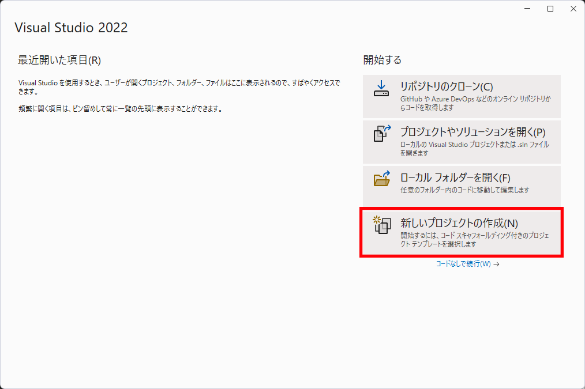
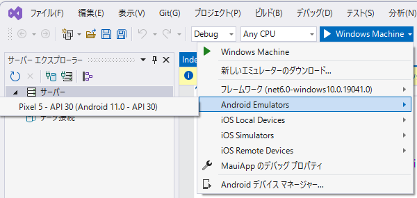
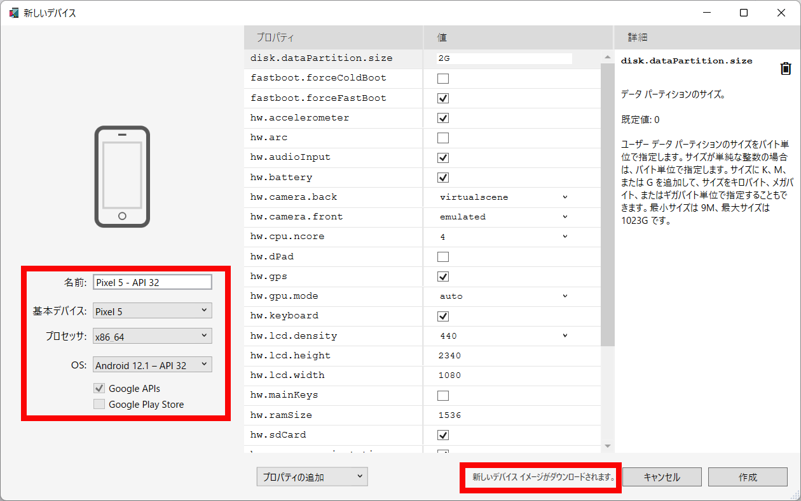

<!-- markdownlint-disable MD033 -->
# ハンズオンドキュメント

## 目次

- 目次を最後に書く

## このドキュメントの場所

`https://github.com/yoHoshino/TrMauiChatApp`

## .NET MAUI hands on lab

このドキュメントでは .NET MAUI と Microsoft.Toolkit.Mvvm を利用した MVVM によるモバイルアプリ開発をハンズオンで学習します。
開発するのは [Azure OpenAI Service](https://learn.microsoft.com/ja-jp/azure/ai-services/openai/overview)(以下AOAI) に接続し、Chat Bot と会話するモバイルアプリです。

## システム要件

- 最新の Windows または macOS
- 最新の Visual Studio 2022 または Visual Studio Code
  - Microsoft.Toolkit.Mvvm パッケージ
- Android SDK
  - Android Emulator

## Visual Studio 2022 のインストール

Visual Studio 2022 の[ダウンロードページ](https://visualstudio.microsoft.com/ja/downloads/)からダウンロードします。  
ダウンロードした `VisualStudioSetup.exe` を実行すると、Visual Studio Installer が起動します。

## ワークロードのインストール

Visual Studio Installer を起動して「.NET マルチプラットフォーム アプリの UI 開発」をインストールします。


## .NET MAUI アプリの作成と動作確認

Visual Studio を起動して「新しいプロジェクト」をクリックします。  


ダイアログで検索窓に `maui` と入力し、「.NET MAUI アプリ」をクリックして .NET MAUI プロジェクトを作成します。  


任意の名前とフォルダにプロジェクトを構成します。（本ドキュメントでは `MobileApp` という名前空間ですので合わせても良いでしょう。）  


フレームワークは「.NET 8.0（長期的なサポート）」を選択してプロジェクトを作成します。
  

## 最初の起動

Android エミュレーターをドロップダウンから選択してデバッグ実行ができます。  
「Android Emulators」が表示されていない場合は、新規にエミュレーターを作成する必要があります。  


### Android エミュレーターの作成

ドロップダウンから「Android デバイスマネージャー」をクリックします。  
表示されるダイアログで「新規」ボタンをクリックします。表示されない場合は、「ツール＞Android＞Android デバイスマネージャー」をクリックします。  
「新規」ボタンをクリックします。  


- 基本デバイス：デバイスのテンプレートでデバイスに応じた画面サイズやメモリ量が決まります。`Pixel 5` などを選んでおくと良いでしょう。
- プロセッサ：`x86` か `x86_64` を選択します。（Intel CPU の仮想化に Hyper-V または Intel HAXM が必要です。）
- OS：エミュレーターの OS を指定します。
- Google APIs／Google Play Store：Google Play Store にチェックを付けると Emulator でマップやストアが利用できます。


各種選択した状態で「新しいデバイスイメージがダウンロードされます。」という注意書きがある場合は、Android SDK のダウンロードサイトから条件に見合った OS イメージを自動でダウンロードしてエミュレーターを作成します。

### エミュレーターに日本語キーボードをインストールする

https://www.javadrive.jp/android/emulator/index4.html

### デバッグ実行

準備が整ったところで最初のデバッグ実行をしてみましょう。  
Android エミュレーターが起動して、次のような画面が表示されれば OK です。

### デフォルトプロジェクトの構成

```text
+ MobileApp
  - Platforms フォルダ
    - Android, iOS, MacCatalyst, Tizen, Windows フォルダ
  - Resources フォルダ
  - App.xaml / App.xaml.cs
  - AppShell.xaml.cs / AppShell.xaml
  - MauiProgram.cs
  - MainPage.xaml / MainPage.xaml.cs
```

#### `Platforms` フォルダ

各ターゲット プラットフォームのフォルダーには、各プラットフォームでアプリを起動するプラットフォーム固有のコードと、追加するプラットフォーム コードが含まれています。  
各種フォルダーは、.NET MAUI がターゲットにできるプラットフォームを表します。

#### `MauiProgram.cs`

アプリケーションのエントリーポイントです。  
プラットフォーム（Android, iOS, Mac, Win）ごとにアプリエントリポイント（`MainApplication` クラス）があり、そこから `CreateMauiApp` メソッドが呼び出されます。

```cs
public static class MauiProgram
{
    public static MauiApp CreateMauiApp()
    {
        var builder = MauiApp.CreateBuilder();
        builder
            .UseMauiApp<App>()
            .ConfigureFonts(fonts =>
            {
                fonts.AddFont("OpenSans-Regular.ttf", "OpenSansRegular");
                fonts.AddFont("OpenSans-Semibold.ttf", "OpenSansSemibold");
            });

#if DEBUG
        builder.Logging.AddDebug();
#endif

        return builder.Build();
    }
}
```

#### `App.xaml.cs`

`App` クラスは `Application` クラスから派生しています。

`App` メソッド内で、初期ページのプロパティ `MainPage` に `AppShell` クラスのインスタンスを指定しています。

```cs
public partial class App : Application
{
    public App()
    {
        InitializeComponent();

        MainPage = new AppShell();
    }
}
```

.NET MAUI Shell アプリでは、アプリのビジュアル階層は、クラスをサブクラス化する Shell クラスで記述されます。

このクラスは、次の 3 つの主要な階層オブジェクトのいずれかで構成されます。([詳細はこちら](https://learn.microsoft.com/ja-jp/dotnet/maui/fundamentals/shell/?view=net-maui-8.0#app-visual-hierarchy))

1. FlyoutItem または TabBar
1. Tab
1. ShellContent

#### `AppShell.xaml`

MobileApp では `ShellContent` で構成されていることが確認できます。

```xml
<?xml version="1.0" encoding="UTF-8" ?>
<Shell
    x:Class="MobileApp.AppShell"
    xmlns="http://schemas.microsoft.com/dotnet/2021/maui"
    xmlns:x="http://schemas.microsoft.com/winfx/2009/xaml"
    xmlns:local="clr-namespace:MobileApp"
    Shell.FlyoutBehavior="Disabled">

    <ShellContent
        Title="Home"
        ContentTemplate="{DataTemplate local:MainPage}"
        Route="MainPage" />

</Shell>
```

#### `AppShell.xaml.cs`

AppShell のパーシャルクラスで、コードビハインドと呼ばれます。

#### `MainPage.xaml`

View のクラスです。XML ベースのクラスを表す言語 XAML で記述します。要素（Element）がインスタンスを表し、属性（Attribute）がプロパティなどを表します。

```xml
<?xml version="1.0" encoding="utf-8" ?>
<ContentPage xmlns="http://schemas.microsoft.com/dotnet/2021/maui"
             xmlns:x="http://schemas.microsoft.com/winfx/2009/xaml"
             x:Class="MobileApp.MainPage">

    <ScrollView>
        <VerticalStackLayout
            Padding="30,0"
            Spacing="25">
            <Image
                Source="dotnet_bot.png"
                HeightRequest="185"
                Aspect="AspectFit"
                SemanticProperties.Description="dot net bot in a race car number eight" />

            <Label
                Text="Hello, World!"
                Style="{StaticResource Headline}"
                SemanticProperties.HeadingLevel="Level1" />

            <Label
                Text="Welcome to &#10;.NET Multi-platform App UI"
                Style="{StaticResource SubHeadline}"
                SemanticProperties.HeadingLevel="Level2"
                SemanticProperties.Description="Welcome to dot net Multi platform App U I" />

            <Button
                x:Name="CounterBtn"
                Text="Click me"
                SemanticProperties.Hint="Counts the number of times you click"
                Clicked="OnCounterClicked"
                HorizontalOptions="Fill" />
        </VerticalStackLayout>
    </ScrollView>

</ContentPage>
```

#### `MainPage.xaml.cs`

MainPage のパーシャルクラスで、コードビハインドと呼ばれます。

`OnCounterClicked` は `CounterBtn` の `Clicked` にバインディングされています。

ボタンをクリックすると数字が１つずつ増えていきます。

```cs
public partial class MainPage : ContentPage
{
    int count = 0;

    public MainPage()
    {
        InitializeComponent();
    }

    private void OnCounterClicked(object sender, EventArgs e)
    {
        count++;

        if (count == 1)
            CounterBtn.Text = $"Clicked {count} time";
        else
            CounterBtn.Text = $"Clicked {count} times";

        SemanticScreenReader.Announce(CounterBtn.Text);
    }
}
```

起動確認は以上です。

## AOAIへの接続

### モデルクラスの作成

まずは Model クラスを作成します。

プロジェクトを右クリックして「追加＞クラス」から `Message` クラスを作成します。次のようになります。  

```csharp
public class Message
{
    public string MessageText { get; set; }
    public string TimeStamp { get; set; }
    public bool IsUserMessage { get; set; }
}
```

### View の作成

次に View を作成していきましょう。`MainPage.xaml` を開きます。

`ScrollView` 内をすべて削除し、次の XAML で置き換えます。次のようになります。

```xml
<Grid Padding="10" RowDefinitions="*, Auto">
    <RefreshView x:Name="ChatRefreshView" Refreshing="PullToRefreshing">
        <CollectionView Grid.Row="0" ItemsSource="{Binding}"
                        SelectionMode="None">
            <CollectionView.ItemTemplate>
                <DataTemplate>
                    <StackLayout Orientation="Horizontal">
                        <Image Source="dotnet_bot.png"
                                WidthRequest="40"
                                HeightRequest="40"
                                Margin="5" />
                        <Frame CornerRadius="10"
                                Padding="10"
                                Margin="5"
                                HasShadow="True"
                                HorizontalOptions="StartAndExpand">
                            <Label Text="{Binding MessageText}"
                                    FontSize="16"
                                    TextColor="Black"/>
                        </Frame>
                    </StackLayout>
                </DataTemplate>
            </CollectionView.ItemTemplate>
        </CollectionView>
    </RefreshView>
    <Grid Grid.Row="1" ColumnDefinitions="*, Auto" Padding="10" x:Name="input">
        <Editor x:Name="MessageEntry"
                Placeholder="Enter a message"
                Grid.Column="0"
                AutoSize="TextChanges"/>
        <Button x:Name="SendButton"
                Text="Send"
                Clicked="OnSendClicked"
                Grid.Column="1"/>
    </Grid>
</Grid>
```

後ほど、同じような View を順を追って少しずつ作成しますので、ここでの詳しい説明は割愛します。

### コードビハインドにコードを追加

`MainPage.xaml.cs` を開きます。

クラス変数として以下を追加します。

```csharp
    public ObservableCollection<Message> ChatMessages { get; set; } = new();
```

次にコンストラクターの下にいくつかのメソッドを追加します。

```csharp
    protected override void OnAppearing()
    {
        base.OnAppearing();
        InitializeChat();
    }

    void InitializeChat()
    {
        ChatMessages.Clear();
        ChatMessages.Add(new Message { MessageText = "質問を入力してください", IsUserMessage = false });
        BindingContext = ChatMessages;
    }

    async void OnSendClicked(object sender, EventArgs e)
    {
        MessageEntry.IsEnabled = false;
        SendButton.IsEnabled = false;

        var userMessage = new Message { MessageText = MessageEntry.Text, IsUserMessage = true };
        ChatMessages.Add(userMessage);
        MessageEntry.Text = string.Empty;

        var responseMessage = await SendRequestAsync(userMessage.MessageText);
        ChatMessages.Add(responseMessage);

        MessageEntry.IsEnabled = true;
        SendButton.IsEnabled = true;
    }

    async void PullToRefreshing(object sender, EventArgs e)
    {
        MessageEntry.IsEnabled = false;
        SendButton.IsEnabled = false;

        await Task.Delay(1000);
        InitializeChat();
        ChatRefreshView.IsRefreshing = false;

        MessageEntry.IsEnabled = true;
        SendButton.IsEnabled = true;
    }

    async Task<Message> SendRequestAsync(string userMessage)
    {
        return new Message
        {
            MessageText = userMessage,
            IsUserMessage = false
        };
    }
```

いくつかのポイントを説明します。

- `OnAppearing` はページ表示時のイベントです。
- `InitializeChat` は表示データの初期化を実施し、`BindingContext` に `ChatMessages` を指定しています。
- `OnSendClicked` は `Button` のイベントハンドラーです。
- `PullToRefreshing` は `RefreshView` の `Refreshing` のイベントハンドラーです。
- `SendRequestAsync` は ダミーデータ(ユーザー入力した文言のオウム返し)を作成し返却します。

### 動作確認(ダミーデータ)

ここでデバッグ実行してみましょう。次のような画面が表示されれば OK です。  
Chatを入力すると、入力した文言をオウム返しされるので試してみましょう。  


### AOAI Endpoint への接続切り替え

`SendRequestAsync` メソッドを、実際のAOAIのEndpointにChatを投げるよう以下のコードに置き換えます。(`_url`と`_apiKey`の内容は別途お伝えします)  
※ 実際の開発では、このようにコードに直接Key情報を書き込むべきではありません。今回はあくまでハンズオンのコードなのでこのようにしています。  
また、今回はハンズオンのため省力して直接AOAIのEndpointを呼び出していますが、実際に開発では別途 Web API を構築してそこからAOAIを呼び出すようにし、MAUIアプリはそのWeb API を呼ぶようにしてセキュリティを高めたほうが良いでしょう。

```cs
    static readonly HttpClient _httpClient = new HttpClient();
    static readonly string _url = "";
    static readonly string _apiKey = "";
    async Task<Message> SendRequestAsync(string userMessage)
    {
        var requestBody = new
        {
            messages = new[]
            {
                    new { role = "system", content = "あなたは.NETのマスコットキャラクターである.NET Bot君です。.NET MAUIに関することを教えてください。" },
                    new { role = "user", content = userMessage },
                    new { role = "assistant", content = "" }
                },
            temperature = 0.8,
            top_p = 0.95,
            frequency_penalty = 0,
            presence_penalty = 0,
            max_tokens = 800,
            stop = "null"
        };

        var json = JsonSerializer.Serialize(requestBody);
        var content = new StringContent(json, Encoding.UTF8, "application/json");
        _httpClient.DefaultRequestHeaders.Clear();
        _httpClient.DefaultRequestHeaders.Add("api-key", _apiKey);

        var response = await _httpClient.PostAsync(_url, content);

        if (response.IsSuccessStatusCode)
        {
            var responseBody = await response.Content.ReadAsStringAsync();
            var responseJson = JsonDocument.Parse(responseBody);
            var assistantMessageContent = responseJson.RootElement
                .GetProperty("choices")[0]
                .GetProperty("message")
                .GetProperty("content")
                .GetString();

            var assistantMessage = new Message
            {
                MessageText = assistantMessageContent ?? "Error!!",
                IsUserMessage = false
            };
            return assistantMessage;
        }
        else
        {
            return new Message
            {
                MessageText = $"Error: {response.StatusCode}",
                IsUserMessage = false
            };
        }
    }
```

再度デバッグ実行し、Chatで質問をしてみます。以下のように適切な回答が得られればOKです。  


標準の .NET MAUI の内容は以上です。

## CommunityToolkit.Mvvmを使用したMVVMとデータバインディングの解説

### MVVMとは

アプリのプログラムを、Model - View - ViewModelという3つの役割に分けて実装するアーキテクチャです。[Model-View-ViewModel (MVVM) | .NET アプリケーション アーキテクチャ ガイド](https://learn.microsoft.com/ja-jp/dotnet/architecture/maui/mvvm)に詳しく解説されています。

### データバインディング

Model - View - ViewModelにプログラムを分けた場合、それぞれのプログラム間でデータのやりとりをする必要があります。例えばModelクラスにおいてHTTPでデータを取得した場合、それをView側に反映させるには変更通知と呼ばれる仕組みを実装する必要があります。  
CommunityToolkit.Mvvmを使用したViewとViewModelのデータバインディングを、MainPage.xamlとViewModelBase.csを例に見ていきましょう。

```xml
<?xml version="1.0" encoding="utf-8" ?>
<ContentPage xmlns="http://schemas.microsoft.com/dotnet/2021/maui"
             xmlns:x="http://schemas.microsoft.com/winfx/2009/xaml"
             x:Class="MobileApp.Views.MainPage"
             xmlns:viewModel="clr-namespace:MobileApp.ViewModels"
             xmlns:model="clr-namespace:MobileApp.Models"
             x:DataType="viewModel:MainPageViewModel"
             Title="{Binding Title}">
```

```cs
using CommunityToolkit.Mvvm.ComponentModel;

namespace MobileApp.ViewModels;

[ObservableObject]
public partial class ViewModelBase
{
    [ObservableProperty]
    private string _title;
}
```

一見どこがどうバインディングされているかわからないかと思いますが、xaml側の`Title="{Binding Title}"`とViewModel側の`private string _title;`はバインディングされています。  
`[ObservableProperty]`というAttributeはCommunityToolkit.Mvvmをインストールすることで使用できるもので、裏側で面倒なバインディングのための記述を生成してくれます。  
本来CommunityToolkit.Mvvmを導入しない場合は下記のようにViewModelを記述しないといけません。プロパティやViewModelのクラスを追加するたびに都度このような記述をしなければなりませんが、CommunityToolkit.Mvvmの機能によりAttributeを付けるだけ裏側でコード生成してくれるので、プログラマーの負担が減ります。

```cs
using System.ComponentModel;
using System.Runtime.CompilerServices;

namespace MobileApp2.ViewModels;

public class ViewModelBase : INotifyPropertyChanged
{
    string _title;

    public string Title
    {
        get => _title;
        set
        {
            if (_title == value)
                return;

            _title = value;
            OnPropertyChanged();
        }
    }


    public event PropertyChangedEventHandler PropertyChanged;

    public void OnPropertyChanged([CallerMemberName]string name = null)
    {
        PropertyChanged?.Invoke(this, new PropertyChangedEventArgs(name));
    }
}

```

### コマンドバインディング

先ほどの章では、Viewのコードビハインドにイベントハンドラーを実装しました。  
しかし、MVVMパターンではViewModelのメソッドをViewからコールする必要があります。そこで、C#ではICommandというinterfaceが用意されています。ただのイベントハンドラーに比べ、抽象化されUIのイベントの実行をしやすいものになっています。

```cs
public interface ICommand
{
    event EventHandler? CanExecuteChanged;
    bool CanExecute(object? parameter);
    void Execute(object? parameter);
}
```

CommunityToolkit.Mvvmでは、`RelayCommand`というICommandの実装が提供されており、このハンズオンでもこれを使用します。Attributeを付加するだけでメソッドをコマンドとしてViewから実行できます。

```cs
[RelayCommand(CanExecute = nameof(CanSend))]
async Task SendClicked()
{
    ・
    ・
    ・
}
```

Viewから使うときは下記のようにします。メソッド名(Async省略) + "Command"で指定します。これもCommunityToolkitが裏側でGetWeathersCommandというコマンドを生成しGetWeathersAsyncメソッドを紐付けてくれています。

```cs
<Button Command="{Binding SendClickedCommand}" Text="Send" />
```

CommunityToolkit.Mvvmを使用したMVVMとデータバインディングの解説は以上になります。

## CommunityToolkit.Mvvmを使用したアプリの作成

ここからは「Start_MVVM」プロジェクトを使って、.NET MAUI + CommunityToolkit.Mvvmの構成で実装をします。  
まずはVisual Studioで「Start_MVVM」プロジェクトを開きましょう。

### Model（Bot）クラスの作成

`Models` フォルダを右クリックして「追加＞クラス」から `Bot` クラスを作成します。  
作成された `Bot` クラスを以下のように書き換えます。

```cs
public class Bot
{
    public string Name { get; set; }
    public string Description { get; set; }
    public string Icon { get; set; }
}
```

### Model（Message）クラスの作成

同様に `Models` フォルダを右クリックして「追加＞クラス」から `Message` クラスを作成します。  
作成された `Message` クラスを以下のように書き換えます。

```cs
public class Message
{
    public string MessageText { get; set; }
    public bool IsUserMessage { get; set; }
    public string Icon { get; set; }
}
```

### サービスのインターフェイスと実装クラスの作成

`Services` フォルダを右クリックして「追加＞新しい項目」から「インターフェイス」を選択し、`IChatService` を作成します。  


`IChatService.cs` で、インターフェイスを `public` 属性にして、`Bot` のコレクションを戻り値に持つ `GetBots` メソッドと、`Message`を戻り値に持つ `SendRequestAsync` を追加します。次のようになります。

```cs
public interface IChatService
{
    List<Bot> GetBots();

    Task<Message> SendRequestAsync(string userMessage, Bot bot);
}
```

インターフェイスはこれで完了です。続いてインターフェイスの実装を作成します。

`Services` フォルダを右クリックして「追加＞クラス」から `ChatService` クラスを作成します。

`ChatService.cs` クラスに `IChatService` の継承を追加し、内容を次のように書き換えます。  
※ `_url` と `_apiKey` に別途お伝えした情報を入れるのを忘れないようにしてください。

```cs
public class ChatService : IChatService
{
    public List<Bot> GetBots()
    {
        return
        [
            new() { Name = "アザラシ", Description = "アザラシ Bot", Icon = "seal.png" },
            new() { Name = "ウシ", Description = "ウシ Bot", Icon = "cow.png"  },
            new() { Name = "オオカミ", Description = "オオカミ Bot", Icon = "wolf.png"  },
            new() { Name = "キツネ", Description = "キツネ Bot", Icon = "fox.png"  },
            new() { Name = "サル", Description = "サル Bot", Icon = "monkey.png"  },
            new() { Name = "ブタ", Description = "ブタ Bot", Icon = "pig.png"  }
        ];
    }

    static readonly HttpClient _httpClient = new HttpClient();
    static readonly string _url = "";
    static readonly string _apiKey = "";

    public async Task<Message> SendRequestAsync(string userMessage, Bot bot)
    {
        var requestBody = new
        {
            messages = new[]
            {
                    new { role = "system", content = $"あなたは動物の{bot.Name}です。あなたの生態や習性は一般的な{bot.Name}と同様です。質問に対する回答は小さな子供でも理解できる言葉づかいで、{bot.Name}になり切って語尾に鳴き声を付けて会話してください。" },
                    new { role = "user", content = userMessage },
                    new { role = "assistant", content = "" }
             },
            temperature = 0.8,
            top_p = 0.95,
            frequency_penalty = 0,
            presence_penalty = 0,
            max_tokens = 800,
            stop = "null"
        };

        var json = JsonSerializer.Serialize(requestBody);
        var content = new StringContent(json, Encoding.UTF8, "application/json");
        _httpClient.DefaultRequestHeaders.Clear();
        _httpClient.DefaultRequestHeaders.Add("api-key", _apiKey);

        var response = await _httpClient.PostAsync(_url, content);

        if (response.IsSuccessStatusCode)
        {
            var responseBody = await response.Content.ReadAsStringAsync();
            var responseJson = JsonDocument.Parse(responseBody);
            var assistantMessageContent = responseJson.RootElement
                .GetProperty("choices")[0]
                .GetProperty("message")
                .GetProperty("content")
                .GetString();

            var assistantMessage = new Message
            {
                MessageText = assistantMessageContent ?? "Error!!",
                IsUserMessage = false,
                Icon = bot.Icon
            };
            return assistantMessage;
        }
        else
        {
            return new Message
            {
                MessageText = $"Error: {response.StatusCode}",
                IsUserMessage = false,
                Icon = bot.Icon
            };
        }
    }
}
```

不足する using は IntelliSense で追加できます。  
赤波線が表示されている `JsonSerializer` の上で Alt + EnterまたはCtrl + .(ピリオド)を押す（または「考えられる修正内容を表示する」をクリックする）とクイックアクションという機能で候補が表示されます。


ここでは `using System.Text.Json;` を選択します。

同様に赤波線が表示されている `Encoding` の上で Alt + EnterまたはCtrl + .(ピリオド)を押す（または「考えられる修正内容を表示する」をクリックする）で、`using System.Text;` を選択します。

`ChatService` はこれで完了です。

### コンテナーへの登録

インターフェイスと実装クラスを追加したので、`MauiAppBuilder` に教える必要があります。  
`MauiProgram.cs` を開き、`CreateMauiApp` メソッド内に次のコードを追加します。

```cs
builder.Services.AddSingleton<IChatService, ChatService>();
```

コンテナーへの登録はこれで完了です。  

### ViewModel の作成 (MainPage)

続いて ViewModel の実装を行います。`MainPageViewModel.cs` を開きます。  

コンストラクターの引数に `IChatService` を追加し、フィールドを追加します。
コンストラクターの末尾に `GetBots()` メソッドの呼び出しを追加します。次のようになります。

```cs
readonly IChatService _chatService;

public MainPageViewModel(IChatService chatService)
{
    Title = "Chat Rooms";
    _chatService = chatService;

    GetBots();
}
```

次に View から参照するプロパティ2つをコンストラクターの上に追加します。

```cs
public ObservableCollection<Bot> Bots { get; set; } = [];

[ObservableProperty]
Bot _selectedBot;
```

次にメソッドを2つ追加します。

```cs
void GetBots()
{
    Bots.Clear();

    var tempChatRoom = _chatService.GetBots();
    foreach (var chatRoom in tempChatRoom)
    {
        Bots.Add(chatRoom);
    }
}

[RelayCommand]
async Task BotSelected()
{
    if (SelectedBot is null)
        return;

    await Shell.Current.GoToAsync(nameof(ChatPage), true, new Dictionary<string, object>
    {
        { "Bot", SelectedBot }
    });
}
```

ViewModel は全体では次のようになっています。

```cs
public partial class MainPageViewModel : ViewModelBase
{
    public ObservableCollection<Bot> Bots { get; set; } = [];

    readonly IChatService _chatService;

    [ObservableProperty]
    Bot _selectedBot;

    public MainPageViewModel(IChatService chatService)
    {
        Title = "Chat Rooms";
        _chatService = chatService;

        GetBots();
    }

    void GetBots()
    {
        Bots.Clear();

        var tempChatRoom = _chatService.GetBots();
        foreach (var chatRoom in tempChatRoom)
        {
            Bots.Add(chatRoom);
        }
    }

    [RelayCommand]
    async Task BotSelected()
    {
        if (SelectedBot is null)
            return;

        await Shell.Current.GoToAsync(nameof(ChatPage), true, new Dictionary<string, object>
        {
            { "Bot", SelectedBot }
        });
    }
}
```

これで ViewModel は完成です。

### View の実装 (MainPage)

View を作成していきましょう。`MainPage.xaml` を開きます。

`Welcome to &#10;.NET Multi-platform App UI` と表示されている `Label` 要素を削除し、代わりに以下の `Label` と `CollectionView` を追加します。

```xml
    <StackLayout>
        <Label Text="Select a Bot"
            FontSize="Large"
            HorizontalOptions="Center" />

        <CollectionView ItemsSource="{Binding Bots}"
            SelectedItem="{Binding SelectedBot}"
            SelectionChangedCommand="{Binding BotSelectedCommand}"
            SelectionMode="Single">
            <CollectionView.ItemTemplate>
                <DataTemplate x:DataType="Model:Bot">
                    <StackLayout Orientation="Horizontal"
                        Padding="8"
                        Spacing="20">
                        <Image Source="{Binding Icon}"
                            WidthRequest="40"
                            HeightRequest="40" />
                        <StackLayout Spacing="4">
                            <Label Text="{Binding Name}"
                                FontSize="Medium" />
                            <Label Text="{Binding Description}"
                                FontSize="Small"
                                TextColor="Gray" />
                        </StackLayout>
                    </StackLayout>
                </DataTemplate>
            </CollectionView.ItemTemplate>
        </CollectionView>
    </StackLayout>
```

`CollectionView` の詳細は [CollectionView | Microsoft Docs](https://learn.microsoft.com/ja-jp/dotnet/maui/user-interface/controls/collectionview/) を参照してください。

今回は指定していませんが、 `ItemsLayout` プロパティで以下の表示方法を利用できます。(指定しない場合はデフォルトの縦方向のリストが表示されます)

- 縦方向のリスト
- 横方向のリスト
- 縦方向のグリッド
- 横方向のグリッド

Layout の詳細は [CollectionView レイアウトの指定 | Microsoft Docs](https://learn.microsoft.com/ja-jp/dotnet/maui/user-interface/controls/collectionview/layout) を参照してください。

このあとデバッグ実行した後に「XAML ホットリロード」の機能で View の体裁を確認できます。

> XAML ホット リロードは、実行中のアプリで XAML の変更の結果を表示できる Visual Studio 機能であり、プロジェクトをリビルドする必要はありません。 XAML ホット リロードを使用しない場合は、XAML の変更の結果を表示するたびにアプリをビルドしてデプロイする必要があります。

### MauiProgram.csにて、作成したViewとViewModelたちを登録

下記のように記述しDIコンテナーに登録します。  
これでViewのコンストラクタの引数としてViewModelを受け取ることができ、紐付けがなされます。

```cs
using Microsoft.Extensions.Logging;
using MobileApp.Services;
using MobileApp.ViewModels;
using MobileApp.Views;

namespace MobileApp;
public static class MauiProgram
{
    public static MauiApp CreateMauiApp()
    {
        var builder = MauiApp.CreateBuilder();
        builder
            .UseMauiApp<App>()
            .ConfigureFonts(fonts =>
            {
                fonts.AddFont("OpenSans-Regular.ttf", "OpenSansRegular");
                fonts.AddFont("OpenSans-Semibold.ttf", "OpenSansSemibold");
            });

        builder.Services.AddSingleton<MainPage>();
        builder.Services.AddSingleton<MainPageViewModel>();
        builder.Services.AddSingleton<ChatPage>();
        builder.Services.AddSingleton<ChatPageViewModel>();

        builder.Services.AddSingleton<IChatService, ChatService>();

#if DEBUG
        builder.Logging.AddDebug();
#endif

        return builder.Build();
    }
}
```

この時点でデバッグ実行してみましょう。以下のような画面が表示されればOKです。


処理の概要を説明します。

この画面が表示された際に、`MainPageViewModel` のコンストラクターが呼び出され、`GetBots()` メソッドでBotの一覧(固定値)を取得します。
`CollectionView` の `ItemSource` には、先ほどViewModelに追加した `Bots` プロパティをBindしているため、`GetBots()` が実行されることでBotの一覧が表示されます。

CollectionViewの `SelectionChangedCommand` に `BotSelectedCommand` をBindしているため、要素をクリックするとViewModelに追加した `BotSelected` メソッドが呼び出され画面遷移が実行されます。

これで1画面目の実装は完了です。

### ViewModel の実装 (ChatPage)

続いて、2画面目(Chat画面)の実装を行います。`ChatPageViewModel.cs` を開きます。

クラス定義の上にAttributeを追加し、同じ名前でプロパティを追加します。  
これで前画面から引数を受け取ることができます。

```cs
[QueryProperty(nameof(Bot), "Bot")]
public partial class ChatPageViewModel : ViewModelBase
{
    [ObservableProperty]
    Bot _bot;
```

コンストラクターの引数に `IChatService` を追加し、フィールドを追加します。次のようになります。

```cs
readonly IChatService _chatService;

public ChatPageViewModel(IChatService chatService)
{
    _chatService = chatService;
}
```

次に View から参照するプロパティをコンストラクターの上にいくつか追加します。

```csharp
public ObservableCollection<Message> ChatMessages { get; set; } = [];

[ObservableProperty]
bool _canSend = true;

[ObservableProperty]
bool _isRefreshing;

[ObservableProperty]
string _messageEntry = string.Empty;
```

続いてメソッドをいくつか追加します。

```cs
partial void OnBotChanged(Bot? oldValue, Bot newValue)
{
    InitializeChat(newValue.Icon);
}

[RelayCommand]
void RefreshClicked()
{
    InitializeChat(Bot.Icon);
}

void InitializeChat(string botIcon)
{
    CanSend = false;

    ChatMessages.Clear();
    ChatMessages.Add(new Message { MessageText = "質問を入力してください", IsUserMessage = false, Icon = botIcon });

    CanSend = true;
    IsRefreshing = false;
}

[RelayCommand(CanExecute = nameof(CanSend))]
async Task SendClicked()
{
    CanSend = false;

    await Task.Delay(1000);

    var userMessage = new Message { MessageText = MessageEntry, IsUserMessage = true };
    ChatMessages.Add(userMessage);
    MessageEntry = string.Empty;

    var responseMessage = await _chatService.SendRequestAsync(userMessage.MessageText, Bot);
    ChatMessages.Add(responseMessage);

    CanSend = true;
    IsRefreshing = false;
}
```

ViewModel は全体では次のようになっています。

```cs
[QueryProperty(nameof(Bot), "Bot")]
public partial class ChatPageViewModel : ViewModelBase
{
    public ObservableCollection<Message> ChatMessages { get; set; } = [];

    readonly IChatService _chatService;

    [ObservableProperty]
    Bot _bot;

    [ObservableProperty]
    bool _canSend = true;

    [ObservableProperty]
    bool _isRefreshing;

    [ObservableProperty]
    string _messageEntry = string.Empty;

    public ChatPageViewModel(IChatService chatService)
    {
        _chatService = chatService;
    }

    partial void OnBotChanged(Bot? oldValue, Bot newValue)
    {
        InitializeChat(newValue.Icon);
    }

    [RelayCommand]
    void RefreshClicked()
    {
        InitializeChat(Bot.Icon);
    }

    void InitializeChat(string botIcon)
    {
        CanSend = false;

        ChatMessages.Clear();
        ChatMessages.Add(new Message { MessageText = "質問を入力してください", IsUserMessage = false, Icon = botIcon });

        CanSend = true;
        IsRefreshing = false;
    }

    [RelayCommand(CanExecute = nameof(CanSend))]
    async Task SendClicked()
    {
        CanSend = false;

        await Task.Delay(1000);

        var userMessage = new Message { MessageText = MessageEntry, IsUserMessage = true };
        ChatMessages.Add(userMessage);
        MessageEntry = string.Empty;

        var responseMessage = await _chatService.SendRequestAsync(userMessage.MessageText, Bot);
        ChatMessages.Add(responseMessage);

        CanSend = true;
        IsRefreshing = false;
    }
}
```

これで ViewModel は完成です。

### Converter の実装

ChatPageは画面の構成がちょっとだけ複雑です。  
ChatBotとの会話を表現するためには以下のことを実現したいですが、シンプルなViewとデータとのBindでは実現できません。

- ChatBotの吹き出しは左側に、ユーザーの吹き出しは右側に寄せて表示したい
- ChatBotの吹き出しにだけアイコンを表示し、ユーザーの吹き出しにはアイコンは表示させたくない
- ChatBotの吹き出しはグレーに、ユーザーの吹き出しはブルーにしたい

上記の要件を実現するためにはそれぞれのプロパティを設定すればいいのですが、プロパティとデータの型が合わない場合Converterを作成して合わせる必要があります。  
※詳細な情報は[公式ドキュメント](https://learn.microsoft.com/ja-jp/dotnet/maui/fundamentals/data-binding/converters?view=net-maui-8.0)を参照してください。

`Converters` フォルダを右クリックして「追加＞クラス」から 以下3つのクラスを追加します。

- BoolToColorConverter.cs

```cs
public class BoolToColorConverter : IValueConverter
{
    public object Convert(object value, Type targetType, object parameter, System.Globalization.CultureInfo culture)
    {
        if (value is bool isUserMessage)
        {
            return isUserMessage ? Colors.LightBlue : Colors.LightGray;
        }
        return Colors.Transparent;
    }

    public object ConvertBack(object value, Type targetType, object parameter, System.Globalization.CultureInfo culture)
    {
        throw new NotImplementedException();
    }
}
```

- BoolToHorizontalOptionsConverter.cs

```cs
public class BoolToHorizontalOptionsConverter : IValueConverter
{
    public object Convert(object value, Type targetType, object parameter, CultureInfo culture)
    {
        if (value is bool isUserMessage)
        {
            return isUserMessage ? LayoutOptions.End : LayoutOptions.Start;
        }
        return LayoutOptions.Start;
    }

    public object ConvertBack(object value, Type targetType, object parameter, CultureInfo culture)
    {
        throw new NotImplementedException();
    }
}
```

- BoolToVisibilityConverter.cs

```cs
public class BoolToVisibilityConverter : IValueConverter
{
    public object Convert(object value, Type targetType, object parameter, CultureInfo culture)
    {
        if (value is bool isUserMessage)
        {
            return !isUserMessage;
        }
        return false;
    }

    public object ConvertBack(object value, Type targetType, object parameter, CultureInfo culture)
    {
        throw new NotImplementedException();
    }
}
```

3つのConverterの作成が終わったら、それらを `App.xaml` に登録します。  
※ `xmlns:converter="clr-namespace:MobileApp.Converters"` も忘れずに追加してください

```xml
<?xml version = "1.0" encoding = "UTF-8" ?>
<Application xmlns="http://schemas.microsoft.com/dotnet/2021/maui"
             xmlns:x="http://schemas.microsoft.com/winfx/2009/xaml"
             xmlns:converter="clr-namespace:MobileApp.Converters"
             x:Class="MobileApp.App">
    <Application.Resources>
        <ResourceDictionary>
            <ResourceDictionary.MergedDictionaries>
                <ResourceDictionary Source="Resources/Styles/Colors.xaml" />
                <ResourceDictionary Source="Resources/Styles/Styles.xaml" />
            </ResourceDictionary.MergedDictionaries>
            <converter:BoolToColorConverter x:Key="BoolToColorConverter" />
            <converter:BoolToHorizontalOptionsConverter x:Key="BoolToHorizontalOptionsConverter" />
            <converter:BoolToVisibilityConverter x:Key="BoolToVisibilityConverter" />
        </ResourceDictionary>
    </Application.Resources>
</Application>
```

これでConverterの作成は完了です。

### View の実装 (ChatPage)

続いて View を作成していきましょう。`ChatPage.xaml` を開きます。  
空の `Grid` があるので、以下のように書き換えましょう。`Grid` には上下2段で以下の要素が組み込まれています。

- `CollectionView` を内包した`RefreshView` (Chatの吹き出し表示領域)
- `Editor` (Chat入力欄) と 送信ボタンを内包したGrid(横方向2段)

`Converter=` で先ほど作成したConverterが指定されています。

```xml
<Grid Padding="10"
    RowDefinitions="*, Auto">
    <RefreshView Command="{Binding RefreshClickedCommand}"
        IsRefreshing="{Binding IsRefreshing}">
        <CollectionView Grid.Row="0"
            ItemsSource="{Binding ChatMessages}"
            SelectionMode="None">
            <CollectionView.ItemTemplate>
                <DataTemplate x:DataType="model:Message">
                    <StackLayout Orientation="Horizontal"
                        HorizontalOptions="{Binding IsUserMessage, Converter={StaticResource BoolToHorizontalOptionsConverter}}">
                        <Image Source="{Binding Icon}"
                            WidthRequest="40"
                            HeightRequest="40"
                            Margin="5"
                            IsVisible="{Binding IsUserMessage, Converter={StaticResource BoolToVisibilityConverter}}" />
                        <Frame BackgroundColor="{Binding IsUserMessage, Converter={StaticResource BoolToColorConverter}}"
                            CornerRadius="10"
                            Padding="10"
                            Margin="5"
                            HasShadow="True"
                            HorizontalOptions="StartAndExpand">
                            <Label Text="{Binding MessageText}"
                                FontSize="16"
                                TextColor="Black" />
                        </Frame>
                    </StackLayout>
                </DataTemplate>
            </CollectionView.ItemTemplate>
        </CollectionView>
    </RefreshView>
    <Grid Grid.Row="1"
        ColumnDefinitions="*, Auto"
        Padding="10"
        x:Name="input">
        <Editor Text="{Binding MessageEntry}"
            Placeholder="Enter a message"
            Grid.Column="0"
            AutoSize="TextChanges" />
        <Button Text="Send"
            Command="{Binding SendClickedCommand}"
            Grid.Column="1" />
    </Grid>
</Grid>
```

#### PullToRefresh について

.NET MAUI では `RefreshView` が用意されています。`RefreshView` の詳細は [RefreshView | Microsoft Docs](https://learn.microsoft.com/ja-jp/dotnet/maui/user-interface/controls/refreshview) を参照してください。

### Routingの追加

MainPageからChatPageに画面遷移するには、画面を作成するだけではなくRoutingを定義する必要があります。
`AppShell.xaml.cs` に以下のように追記しましょう。

```cs
public partial class AppShell : Shell
{
    public AppShell()
    {
        InitializeComponent();

        Routing.RegisterRoute(nameof(ChatPage), typeof(ChatPage));
    }
}
```

この時点でデバッグ実行してみましょう。  
1画面目でChatBotを選択しChat画面に遷移後、以下のように質問に回答が返ってくればOKです。


### Mockの追加

まだ Web API が完成していない場合やテストをする場合を考慮して、ダミーデータを利用するようにしてみましょう。

`Services` フォルダを右クリックして「追加＞クラス」をクリックし、`MockChatService.cs` と名前を付けてクラスを作成します。

`IChatService` の継承を追加し、実装を追加します。次のようになります。

```csharp
public class MockChatService : IChatService
{
    public List<Bot> GetBots()
    {
        return
        [
            new() { Name = "アザラシ", Description = "アザラシ Bot", Icon = "seal.png" },
            new() { Name = "ウシ", Description = "ウシ Bot", Icon = "cow.png"  },
            new() { Name = "オオカミ", Description = "オオカミ Bot", Icon = "wolf.png"  },
            new() { Name = "キツネ", Description = "キツネ Bot", Icon = "fox.png"  },
            new() { Name = "サル", Description = "サル Bot", Icon = "monkey.png"  },
            new() { Name = "ブタ", Description = "ブタ Bot", Icon = "pig.png"  }
        ];
    }

    public Task<Message> SendRequestAsync(string userMessage, Bot bot)
    {
        return Task.FromResult(new Message { MessageText = userMessage, IsUserMessage = false, Icon = bot.Icon });
    }
}
```

次に `MauiProgram.cs` を開き、`ChatService` を登録していた部分を次のように修正します。

```csharp
#if DEBUG
        builder.Services.AddSingleton<IChatService, MockChatService>();
        builder.Logging.AddDebug();
#else
        builder.Services.AddSingleton<IChatService, ChatService>();
#endif
```

これでデバッグ用に MockChatService を利用できるようになりました。  
デバッグ実行して、ユーザー入力をオウム返しにする動作になっていればOKです。


## お疲れ様でした

これで本日のトレーニングはすべて終了です。.NET MAUI にはもっと色々な機能があります。是非使いこなして皆様のモバイルアプリ開発が楽しくなることを願っています！

## Appendix

### アイコンを変えてみよう

今回のハンズオンでは、手順省略のためStart_MVVM Projectにあらかじめアイコンを入れておきました。
.NET MAUI では、`Resources/Images` に画像ファイルを配置することでViewから参照できるようになります。


お好きな画像を入れてみて、アイコン画像を変更してみましょう。  
(アイコン画像ファイル名の指定は、Service Class 内の `GetBots()` で実施していますので、こちらも忘れずに変更しましょう)  
[アイコンフリー素材](http://flat-icon-design.com/)

### BotのSystem Message や設定を改造しよう

Service Class 内で以下のようにプロンプトを定義しています。

```cs
var requestBody = new
{
    messages = new[]
    {
            new { role = "system", content = $"あなたは動物の{bot.Name}です。あなたの生態や習性は一般的な{bot.Name}と同様です。質問に対する回答は小さな子供でも理解できる言葉づかいで、{bot.Name}になり切って語尾に鳴き声を付けて会話してください。" },
            new { role = "user", content = userMessage },
            new { role = "assistant", content = "" }
        },
    temperature = 0.8,
    top_p = 0.95,
    frequency_penalty = 0,
    presence_penalty = 0,
    max_tokens = 800,
    stop = "null"
};
```

[公式ドキュメント](https://learn.microsoft.com/ja-jp/azure/ai-services/openai/reference#chat-completions)に設定できる項目の一覧が載っていますので、これを参考にしてSystem Message や各設定値を変更してみましょう。違った回答が返ってきます。

